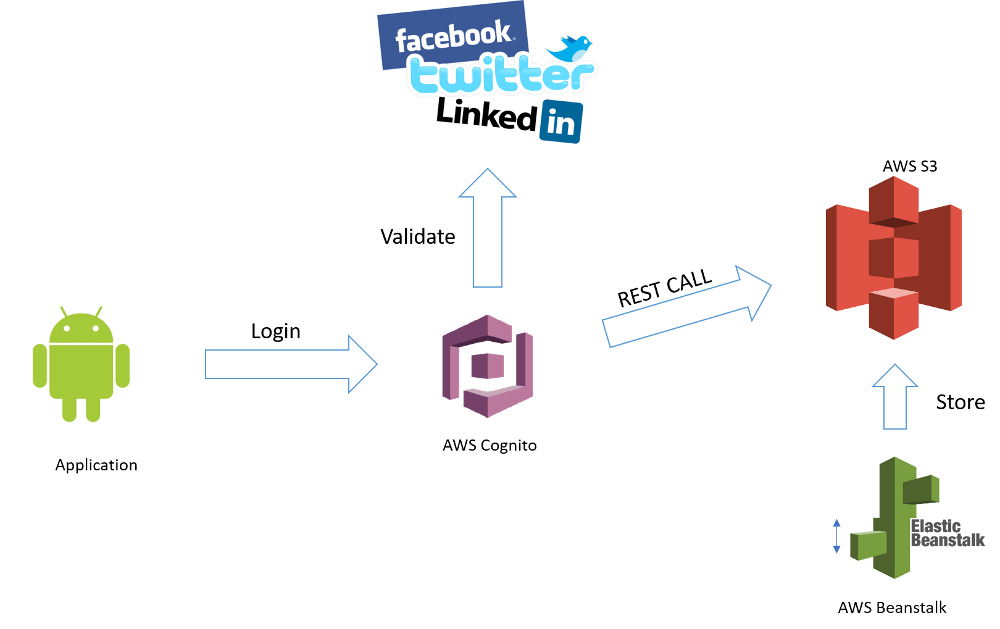

# About
List of movies and series available in theaters today

- S3
- Cognito
- Beanstalk
- Node.JS
- Android

# Android application

  

# How it works

  

1 - Web Crawler

Cron job deployed in AWS Beanstalk which will parse www.themoviedb.com, and save the results as JSON, then upload it to AWS S3.

2 - UI

Android application which will consume the json file by doing a GET call.

# Contributors

Mohamed Labouardy <mohamed@labouardy.com>
